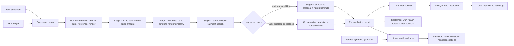

# Architecture and AI Decision Boundary

## System flow

## What uses an LLM

| Decision | Implementation | Why |
|---|---|---|
| Exact reference and money comparison | Deterministic, cent-normalized rules | A correct answer is directly provable; an LLM adds risk. |
| Fuzzy vendor/date/amount matching | Deterministic bounded heuristic | The windows and vendor score are inspectable and repeatable. |
| Split settlements | Bounded combination search in integer paise | Arithmetic must be deterministic. |
| Leftover ambiguity | Optional local Qwen2.5-3B Stage 4 | Language can help explain plausible operational ambiguity. |
| Settlement narrative | Optional local LLM, grounded on report rows | The answer is useful only when tied to the reconciliation state. |

The LLM is not a source of truth. A Stage 4 proposal must pass all of these
checks before it can become a match:

- valid bank and ledger row indices;
- one-to-one assignment after confidence sorting;
- configured confidence threshold;
- bounded amount and date differences; and
- no conflicting non-empty reference IDs.

If the checks fail, the row remains in the exception or human-review queue.

## Reliability controls

- **Paise normalization:** Stages 1–3 compare integer cents/paise, avoiding
  binary-float boundaries in split totals.
- **Reference conflict guard:** non-empty references that disagree are never
  eligible for fuzzy, heuristic, or LLM matching.
- **Hidden-truth benchmark:** `benchmark_engine.py` strips `_truth_id` and
  `_scenario` before rows reach the matching stages. The scorer alone receives
  those labels.
- **Honest exception contract:** the evaluator tracks false positives,
  collisions, missed matchable rows, and intentionally unresolved exceptions.
- **Bounded API behavior:** JSON uploads are capped at 25 MB; malformed or
  incomplete requests return a safe 4xx response without an internal traceback.
- **Policy-limited actions:** batch action applies only to `likely_bank_fee`
  items within the configured limit. Critical review cases require a human
  action.
- **Audit evidence:** resolution events form a locally verifiable hash chain.
  This is prototype audit evidence, not a replacement for a signed,
  access-controlled accounting ledger.

## Production hardening next

For a production deployment, replace the local JSON state with a transactional
database, require authenticated roles and dual approvals for postings, sign audit
records with managed keys, add tenant isolation, encrypt stored statements, and
connect journal posting to the system of record through an approved integration.
